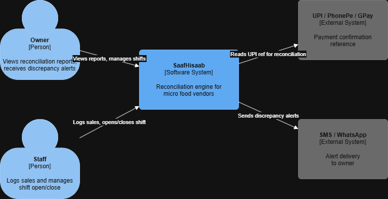
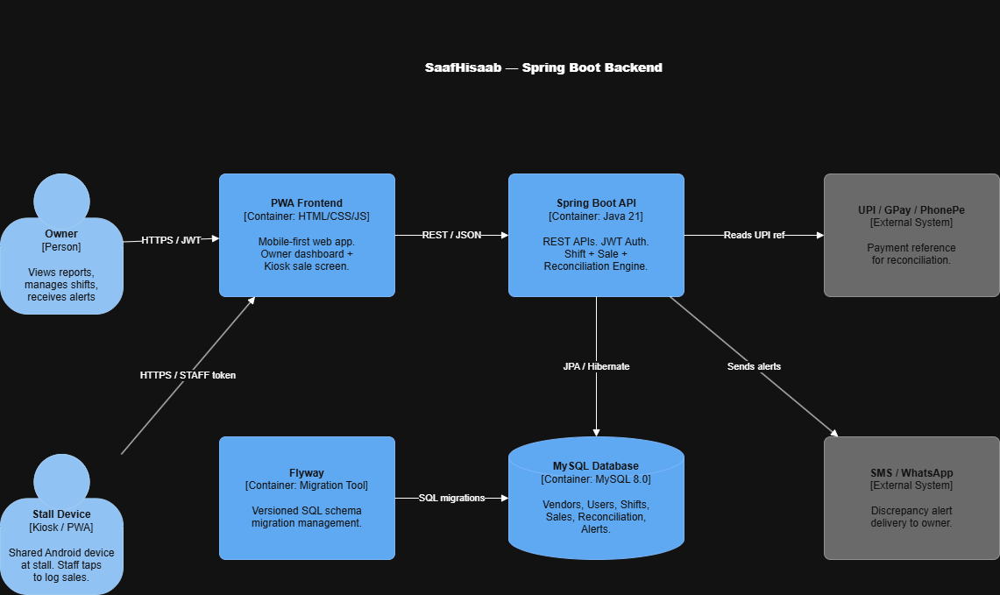
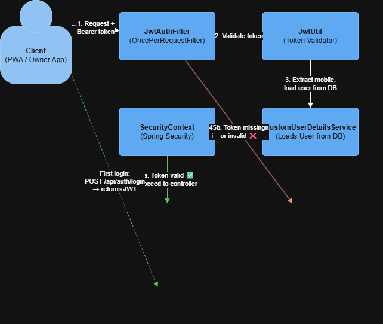
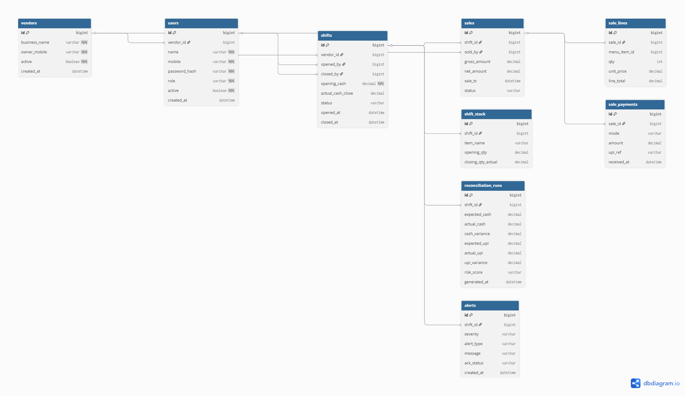

# SaafHisaab — Shift Reconciliation Engine

> A mobile-first SaaS platform that eliminates cash skimming at micro food vendor stalls by reconciling inventory, sales, and payments at every shift close.

---

## The Problem

Small food vendors — chai stalls, momo stands, poha-jalebi shops — lose **10–20% of daily revenue** to cash skimming when the owner is absent. Hired staff pocket cash with zero accountability.

Existing POS systems are too expensive, complex, and slow for vendors doing ₹2,000–₹10,000/day in high-volume, fast-paced sales.

---

## The Solution

SaafHisaab forces accountability through a simple shift workflow:

1. **Shift Open** — Owner logs opening stock and opening cash
2. **During Shift** — Every sale is logged in 2 taps on a shared stall device
3. **Shift Close** — Engine reconciles expected vs actual cash, UPI, and inventory
4. **Alert** — Any discrepancy is flagged instantly to the owner's phone

---

## Operating Models

| Model | When | How |
|---|---|---|
| **Model B** | Stall has a shared device | Staff taps sales on kiosk PWA, owner monitors remotely |
| **Model A** | No shared device | Owner logs everything themselves via their smartphone |

Both models use identical backend APIs — role is detected from JWT and access is restricted accordingly.

---

## Tech Stack

| Layer | Technology |
|---|---|
| Backend | Java 21, Spring Boot 4.0.3 |
| Security | Spring Security + JWT — RBAC (OWNER / STAFF) |
| Database | MySQL 8.0 + Spring Data JPA + Hibernate |
| Schema Migrations | Flyway |
| Frontend | HTML/CSS/JS — Progressive Web App (PWA) |
| Monitoring | Spring Boot Actuator |

---

## Architecture Diagrams

### C4 Context — System Overview

### C4 Container — Internal Architecture

### JWT Authentication Flow

---

## Database Schema

### ER Diagram

### Core Tables

| Table | Purpose |
|---|---|
| `vendors` | Root tenant — one per business owner |
| `users` | Owner and Staff accounts with RBAC |
| `shifts` | Core business event — opened and closed per day |
| `sales` | Every logged transaction during a shift |
| `sale_lines` | Line items within each sale |
| `sale_payments` | Cash or UPI payment per sale |
| `shift_stock` | Opening and closing inventory count |
| `reconciliation_runs` | Computed variance per shift close |
| `alerts` | Owner notifications on discrepancies |

---

## Security Design

- Stateless JWT authentication — no server-side sessions
- Role-based access control — `OWNER` and `STAFF` have separate permissions
- STAFF/kiosk tokens are scoped to sale logging only
- All endpoints protected except `/api/auth/**`
- Passwords stored as BCrypt hashes — never plain text
- `@EnableMethodSecurity` — `@PreAuthorize` on every controller method

---

## API Reference

### Auth Endpoints (Public)
| Method | Endpoint | Description |
|---|---|---|
| POST | `/api/auth/register` | Register new vendor + owner account |
| POST | `/api/auth/login` | Login — returns JWT token |

### Shift Endpoints (OWNER)
| Method | Endpoint | Description |
|---|---|---|
| POST | `/api/shifts/open` | Open a new shift |
| POST | `/api/shifts/close` | Close shift and trigger reconciliation |
| GET | `/api/shifts/{id}` | Get shift details |

### Sale Endpoints (OWNER + STAFF)
| Method | Endpoint | Description |
|---|---|---|
| POST | `/api/sales` | Log a sale |
| GET | `/api/sales/shift/{shiftId}` | Get all sales for a shift |

### Reconciliation Endpoints (OWNER)
| Method | Endpoint | Description |
|---|---|---|
| GET | `/api/reconciliation/{shiftId}` | View reconciliation report |
| GET | `/api/alerts` | View all discrepancy alerts |

---

## Reconciliation Logic
Expected Cash = Opening Cash
+ Σ Cash Sales
− Σ Cash Refunds
− Σ Cash Expenses

Expected UPI = Σ UPI Payments for shift

Expected Stock = Opening Qty
− Σ Recipe Consumption
− Σ Wastage Adjustments

Variance > Threshold → HIGH severity alert to owner

---

## Project Structure
com.saafhisaab.engine
├── config → SecurityConfig, CORS
├── controller → AuthController, ShiftController, SaleController
├── dto
│ ├── request → LoginRequest, RegisterRequest, SaleRequest
│ └── response → AuthResponse, ShiftResponse, ReconciliationResponse
├── entity → Vendor, User, Shift, Sale, SaleLine, SalePayment
├── enums → Role, ShiftStatus, PaymentMode, AlertSeverity
├── exception → GlobalExceptionHandler, custom exceptions
├── repository → Spring Data JPA interfaces
├── security
│ ├── jwt → JwtUtil, JwtAuthFilter
│ └── service → CustomUserDetailsService
├── service
│ └── impl → Business logic implementations
└── util → Helper classes

---

## Interview Note

> The backend codebase is maintained in a **private repository** to protect commercial business logic.  
> Available for **live walkthrough during technical interviews** on request — including Spring Security implementation, JWT filter chain, and reconciliation algorithm.

---

## Author

**Fawwaz Khilji** — Java Backend Developer (5 Years)  
📧 Email[fawwazkhiljiofficial@gmail.com]
💼 LinkedIn[https://www.linkedin.com/in/fawwazkhilji/]